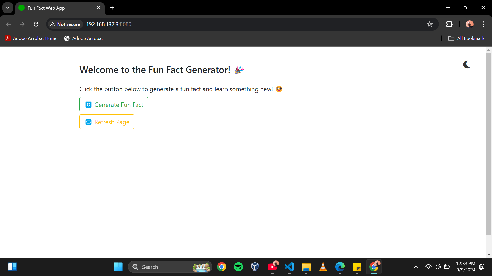
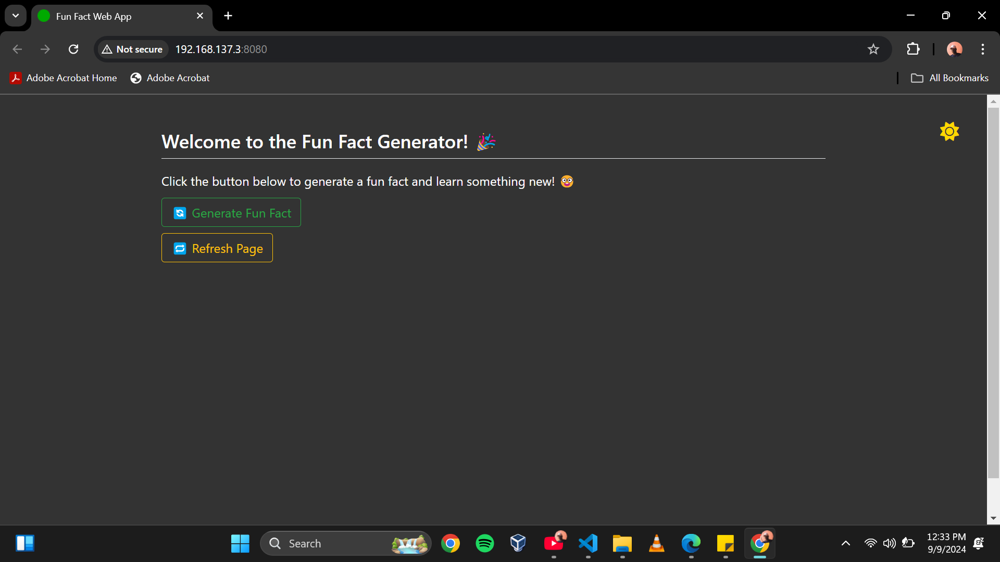
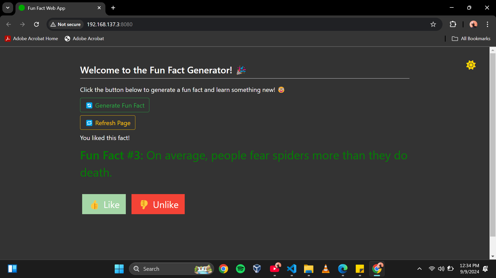

# KUBOMU-EDWIN-GEORGE
# Fun Fact Generator App

## Overview

Fun Fact Generator is a simple web application that fetches and displays random fun facts. It includes features like dark/light mode toggling, generating new facts, and liking/unliking facts.

## Features

- **Generate Random Facts**: Click a button to fetch and display a random fun fact.
- **Dark/Light Mode**: Toggle between dark and light themes.
- **Like/Unlike Facts**: Like or unlike the displayed fact.
- **Refresh Page**: Refresh the page to reset the state.

## Screenshots

### Light Mode


### Dark Mode


### Liked Fact


## Installation

1. **Clone the repository**:
    ```sh
    git clone https://github.com/Department-of-Computer-Science-GU/KUBOMU-EDWIN-GEORGE.git
    cd KUBOMU-EDWIN-GEORGE
    ```

2. **Install dependencies**:
    ```sh
    pip install -r requirements.txt
    ```

3. **Run the server**:
    ```sh
    python app.py
    ```

4. **Open your browser** and navigate to `http://localhost:8080`.

## Usage

1. **Generate a Fun Fact**: Click the "Generate Fun Fact" button to fetch and display a random fact.
2. **Toggle Dark/Light Mode**: Click the moon/sun icon to switch between dark and light modes.
3. **Like/Unlike Facts**: Click the like/unlike buttons to indicate your preference for the displayed fact.
4. **Refresh Page**: Click the "Refresh Page" button to reload the page.

## License

This project is licensed under the MIT License - see the [LICENSE](LICENSE) file for details.

## Contributing

Contributions are welcome! Please open an issue or submit a pull request.

## Acknowledgments

- Thanks to the [Useless Facts API](https://uselessfacts.jsph.pl/) for providing the random facts.
- Thanks to [Font Awesome](https://fontawesome.com/) for the icons.
