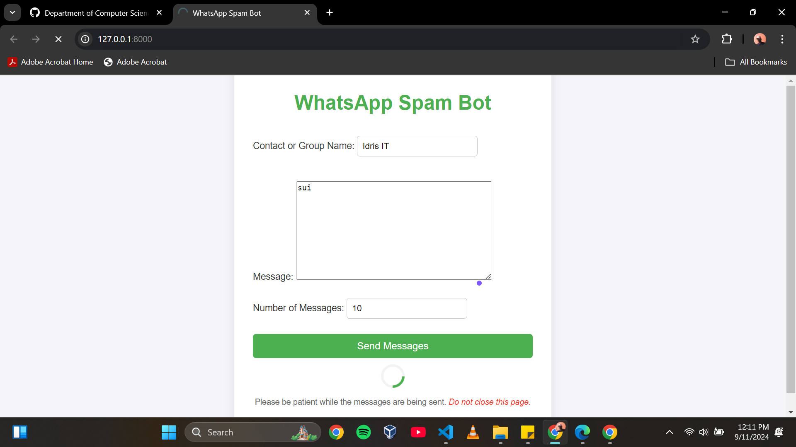
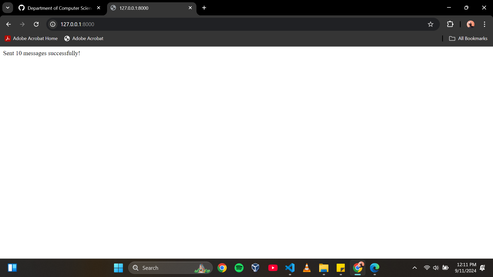

# WhatsApp Spam Bot

This project is a Django application that allows users to send multiple WhatsApp messages to a specified contact using Selenium. It is intended for study purposes to demonstrate the use of Selenium for automation tasks.

Note: This project is intended for study purposes only. Please use responsibly and in accordance with WhatsApp's terms of service.

## Table of Contents

- [Features](#features)
- [Screenshots](#screenshots)
- [Installation](#installation)
- [Usage](#usage)
- [Configuration](#configuration)


## Features

- Send multiple WhatsApp messages to a specified contact.
- Easy-to-use web interface for inputting contact name, message, and number of messages.
- Automated message sending using Selenium.


## Screenshots

### User Interface


### Success



## Installation

1. **Clone the repository:**

    ```sh
    git clone https://github.com/Department-of-Computer-Science-GU/KUBOMU-EDWIN-GEORGE.git
    ```

2. **Create a virtual environment and activate it:**

    ```sh
    python -m venv venv
    source venv/bin/activate  # On Windows use `venv\Scripts\activate`
    ```

3. **Install the required packages:**

    ```sh
    pip install -r requirements.txt
    ```

4. **Set up the Django project:**

    ```sh
    python manage.py migrate
    ```

5. **Run the development server:**

    ```sh
    python manage.py runserver
    ```

6. **Access the application:**

    Open your web browser and go to `http://127.0.0.1:8000/`.

## Usage

1. **Open the application in your web browser.**
2. **Fill out the form with the contact name, message, and number of messages you want to send.**
3. **Submit the form.**
4. **The application will open WhatsApp Web, search for the contact, and send the specified number of messages.**

## Configuration

- **ChromeDriver Path:**
  Ensure that the path to the ChromeDriver executable is correctly set in the `driver_path` variable in the `send_message` function.

  ```python
  driver_path = 'C:/WebDriver/chromedriver.exe'  # Ensure this is the correct path


 
